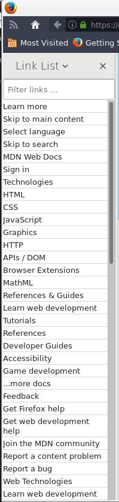
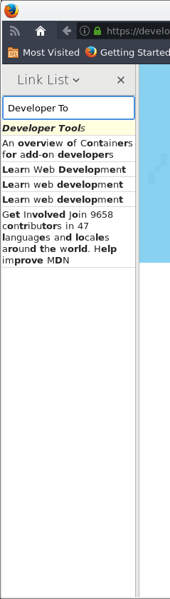

# Link List

Shows all links on a page in a flat list.

## Usage

After installing the extension "Link List," display the sidebar.

To filter for a certain link, enter the text in the `Filter links...`
textbox. Exact matches will be up at the top hilighted in yellow.

Click on the desired link and the current tab selection will be replaced by the
desired link.
